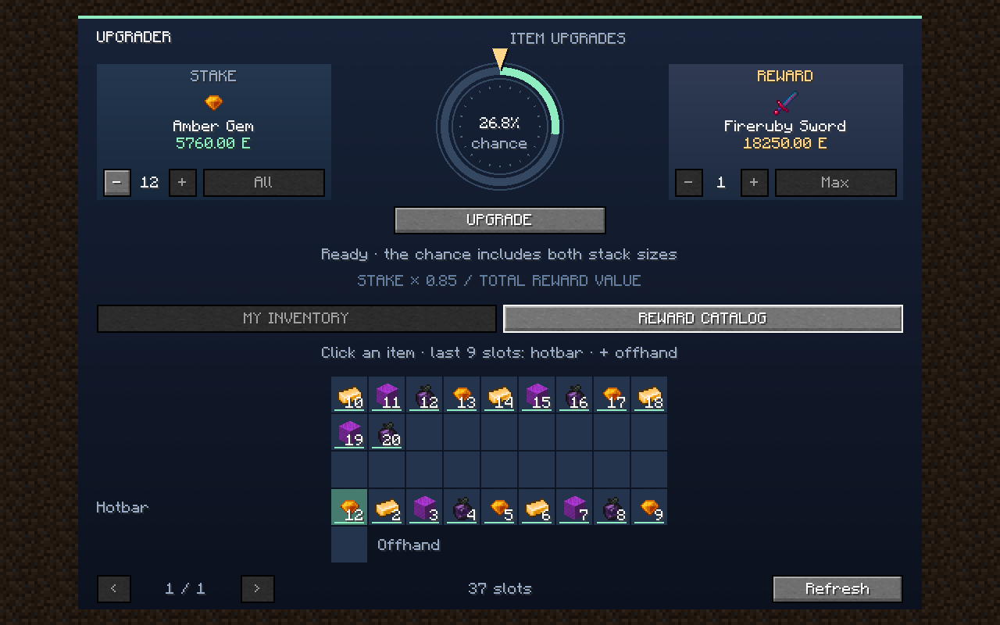
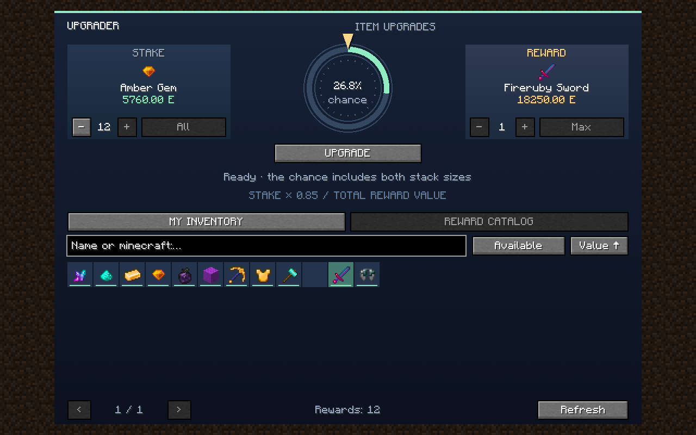
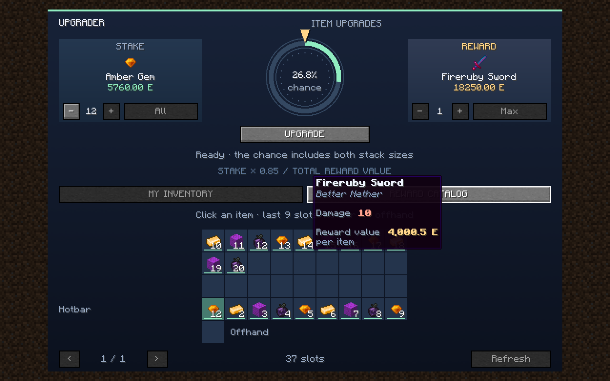
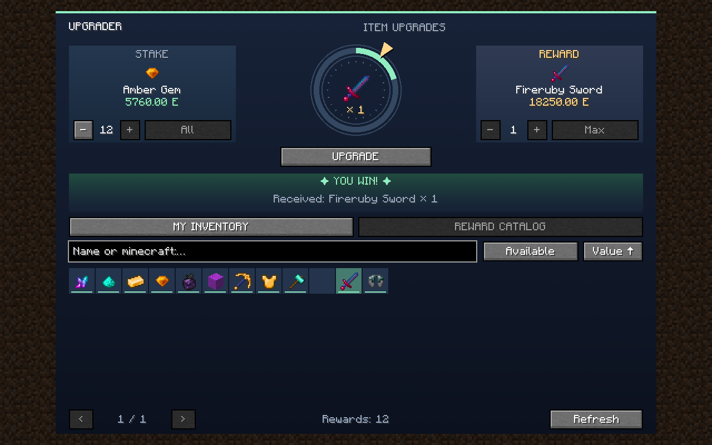

<div align="center">


# Modded Item Upgrader

**Risk the items you have for a chance to win something better.**

[](https://www.curseforge.com/minecraft/mc-mods/magersers-upgrader/files/all)
[](https://www.curseforge.com/minecraft/mc-mods/magersers-upgrader/files/all)
[](https://fabricmc.net/)
[](https://github.com/Magersers/minecraft_upgrader/releases/tag/v0.6.5)
[](LICENSE)

[Download 0.6.5 on GitHub](https://github.com/Magersers/minecraft_upgrader/releases/tag/v0.6.5) · [CurseForge](https://www.curseforge.com/minecraft/mc-mods/magersers-upgrader) · [English publishing text](docs/publishing/description-en.md) · [Русское описание](docs/publishing/description-ru.md)

</div>

Modded Item Upgrader adds an inventory-based upgrade wheel to Minecraft. Choose an item from your inventory as the stake, select the reward and quantity you want, review the exact success chance, and spin.

A successful roll delivers the reward after the animation. A failed roll consumes the stake. The system uses ordinary in-game items only—there are no purchases, premium currencies, or real-money mechanics.

> The interface, tooltips, results, and server messages follow Minecraft’s selected language, with 22 supported locales and English fallback. See [supported languages and translation guide](docs/localization.md). Item names use Minecraft’s own translations.

## How it works

1. Open your inventory and press the green **upgrade arrow**, or run `/upgrade` in Survival mode.
2. Choose a stake from your main inventory, hotbar, or off-hand and set its quantity.
3. Search the reward catalog by localized name or item ID, then choose the reward quantity.
4. Review the chance and press **Upgrade**.

The chance is calculated from the total value of the selected stake and reward stack:

```text
chance = min(95%, 85% × stake value / reward value)
```

The reward must be more valuable than the stake. For example, a 100 E stake against a 200 E reward gives a 42.5% chance.

## See it in action

<table>
  <tr>
    <td width="50%" align="center"><strong>Choose a stake from your inventory</strong><br><br></td>
    <td width="50%" align="center"><strong>Browse rewards and compare values</strong><br><br></td>
  </tr>
  <tr>
    <td width="50%" align="center"><strong>Inspect item stats, source mod, and value</strong><br><br></td>
    <td width="50%" align="center"><strong>Receive the result when the wheel stops</strong><br><br></td>
  </tr>
</table>

## Features

- Direct stake selection from all 37 player inventory slots, including the hotbar and off-hand.
- Searchable reward catalog with filters, sorting, pages, and stack-size controls.
- Animated upgrade wheel with sound effects and clear win/loss feedback.
- Recipe-aware values based on ingredients, output counts, alternative materials, and processing costs.
- Mod-aware tooltips showing the source mod, combat or armor stats, and per-item value.
- Automatic value reduction for worn equipment, up to 99% depending on damage.
- Server-side validation of the selected slot, quantities, item data, progression gates, and payout.
- Persistent delayed rewards: accepted wins survive reconnects and deaths until delivered.
- Datapack balance profiles and `/upgrade audit` reports for modpack authors and server administrators.
- Optional hard mode that lowers the stake value of simple building resources.

## Requirements

Install the matching JAR on **both the client and the server**. Single-player is supported through Minecraft's integrated server.

| Minecraft | Java | Fabric Loader | Fabric API | Release file |
|---|---:|---:|---|---|
| 1.20.1 | 17+ | 0.17.2+ | 0.92.12+1.20.1 or compatible | `upgrade-fabric-1.20.1-0.6.5.jar` |
| 1.21.1 | 21+ | 0.17.2+ | 0.116.17+1.21.1 or compatible | `upgrade-fabric-1.21.1-0.6.5.jar` |

Use only the file made for your exact Minecraft version. The 1.20.1 and 1.21.1 JARs are not interchangeable, and every player must run the same Upgrader version as the server.

## Modded items and modpacks

Upgrader reads supported recipes, tags, item attributes, and acquisition data from the installed game. Material costs can flow through normal crafting chains and supported modded processing systems instead of giving every unknown item an arbitrary price.

Fabric 1.20.1 integration has been checked with BetterEnd, BetterNether, BCLib, TechReborn, and Hephaestus-related content. Custom machines, unusual item data, hidden abilities, contextual loot, energy, or fluid recipes may still require a datapack value profile or dedicated adapter.

Server administrators can run `/upgrade audit` to generate `logs/upgrade-economy.json`, including unavailable or excluded items and the reason for every result. Balance data can be replaced or extended with datapacks and reloaded with `/reload`.

This project does not claim automatic compatibility with every item in every modpack. Please report reproducible compatibility problems through [GitHub Issues](https://github.com/Magersers/minecraft_upgrader/issues).

## Building from source

The Fabric project is located in `fabric/` and shares one economy core across supported Minecraft versions.

```sh
./gradlew -p fabric -Pminecraft_version=1.20.1 build
./gradlew -p fabric -Pminecraft_version=1.21.1 build
```

Build outputs are written to `fabric/build/<minecraft-version>/libs/`. Development requires JDK 17 for Minecraft 1.20.1 and JDK 21 for Minecraft 1.21.1.

Useful technical references:

- [Fabric 0.6 economy, attributes, and hard mode](docs/releases/fabric-0.6.1.md)
- [Fabric 0.6.3 balance changes](docs/releases/fabric-0.6.3.md)
- [Publishing metadata and platform notes](docs/publishing/platforms.md)

## License and credits

Created by **Magersers**. Releases starting with 0.6.4 use the [Magersers Proprietary License — All Rights Reserved](LICENSE). Gameplay and private use are allowed; reuploads and distribution of modified versions require written permission. Modpack manifests may reference the official download.

Development and documentation used substantial AI assistance. The promotional logo is AI-generated artwork, not an in-game screenshot. Its Atomic Disassembler-style tool is a visual shorthand for mod compatibility; Upgrader does not add that item and is not affiliated with Mekanism. The interface images above are real captures of the rendered mod UI with BetterEnd and BetterNether loaded. The mod does not call an AI service during gameplay.

Minecraft is a trademark of Microsoft. This project is not approved by or associated with Mojang or Microsoft.
